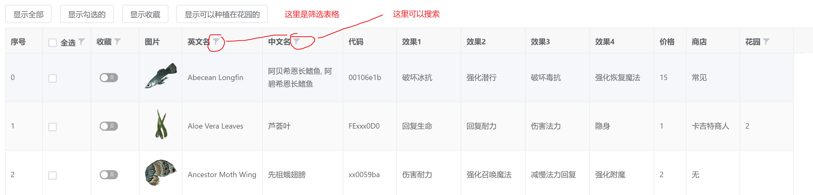

上古卷轴5天际 所有练金材料效果,以及可以组成的配方列表.可筛选,可收藏
# 数据来源
1. https://en.uesp.net/wiki/Skyrim:Ingredients
2. https://steamcommunity.com/sharedfiles/filedetails/?id=1378262872
3. https://wiki.biligame.com/skyrim/%E7%82%BC%E9%87%91%E6%95%88%E6%9E%9C
4. 参考中英文词汇表 https://wiki.biligame.com/skyrim/%E4%B8%8A%E5%8F%A4%E5%8D%B7%E8%BD%B45%E5%A4%A9%E9%99%85:%E8%AF%8D%E6%B1%87%E8%A1%A8/%E6%A4%8D%E7%89%A9%E5%92%8C%E7%82%BC%E9%87%91
5. 控制台 player.additem 代码 数量
6. 代码前面的xx 表示mod序号 01-99 根据不同的电脑mod载入顺序不同而不同,所以需要尝试
7. FExxx  中的 xxx也表示 001-999 根据电脑mod顺序不同而不同

# 安装说明
直接下载release版本 
或者下载所有文件 放到 nw.js(调试使用的是0.13.0)中.
运行 nw.exe 

# 使用说明 

1. 勾选第二列(选中你想要的材料,生成的就是这些材料组成的配方)
2.点击 "勾选材料后点击这里计算配方"

# 使用的开源库 已经打包到 jsimgcss目录了
vue2,xe-utils,vxe-table